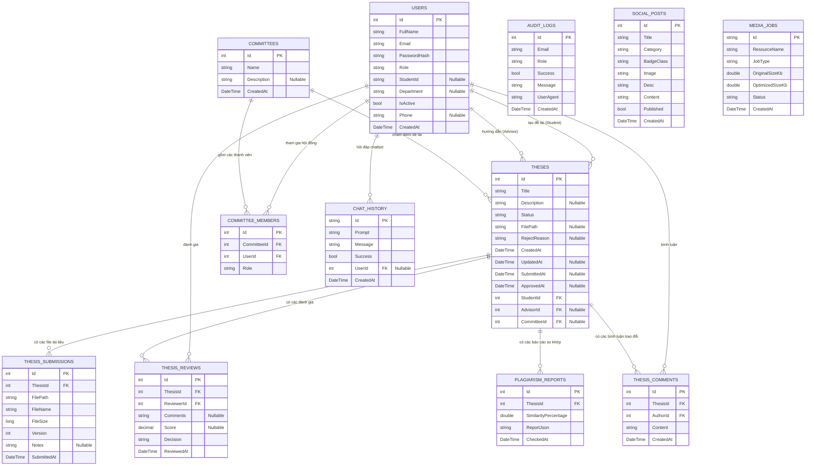
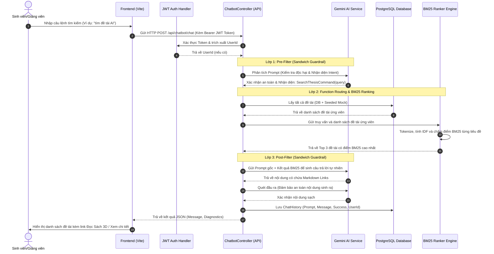

# 🎓 eThesis — Nền tảng Quản lý Khóa luận Tốt nghiệp & Đề tài Nghiên cứu Khoa học

> **Đồ án tốt nghiệp đại học** · Ngành Công nghệ Thông tin · Trường Đại học Kinh tế - Tài chính TP.HCM (UEF)

---

## 📌 Tổng quan đề tài

Trong bối cảnh học thuật tại các trường đại học Việt Nam, kho tàng khóa luận tốt nghiệp và đề tài nghiên cứu khoa học của sinh viên là một tài sản tri thức vô cùng quý giá. Tuy nhiên, hầu hết các tài liệu này sau khi bảo vệ xong đều bị lưu trữ phân mảnh trong ổ cứng cá nhân, thư viện truyền thống hoặc các thư mục chia sẻ rời rạc. Điều này dẫn đến nhiều hạn chế:

- **Lãng phí tiềm năng tri thức:** Các thế hệ sinh viên tiếp theo rất khó tiếp cận để tham khảo các đề tài xuất sắc đi trước.
- **Khó kiểm soát trùng lặp và tính liêm chính:** Việc tìm kiếm thủ công để kiểm tra độ tương đồng giữa các đề tài mới và cũ là không khả thi.
- **Thiếu công cụ tra cứu thông minh:** Sinh viên chỉ có thể tìm kiếm theo tiêu đề đơn giản, không thể tìm kiếm toàn văn (full-text search) hoặc hỏi đáp trực tiếp theo ngữ nghĩa.


**eThesis** được xây dựng như một nền tảng **Thư viện số Học thuật & Tra cứu Đề tài Thông minh**, hỗ trợ số hóa, lưu trữ tập trung và tìm kiếm nâng cao dành riêng cho môi trường đại học. Hệ thống tích hợp **Trí tuệ nhân tạo (Gemini AI)**, **thuật toán xếp hạng ngữ nghĩa BM25/Elasticsearch**, cùng giao diện hiện đại sử dụng công nghệ React 19 tiên tiến nhất hiện nay.

---

## 🎯 Mục tiêu & Phạm vi hệ thống

### Mục tiêu tổng quát
Xây dựng một nền tảng **Thư viện số Học thuật** toàn diện, tích hợp trí tuệ nhân tạo, phục vụ lưu trữ, quản lý và khai thác hiệu quả tài liệu khóa luận tốt nghiệp và đề tài nghiên cứu khoa học tại các cơ sở giáo dục đại học.

### Mục tiêu cụ thể
1. **Số hóa kho dữ liệu học thuật:** Xây dựng kho lưu trữ số tập trung cho toàn bộ khóa luận và đề tài nghiên cứu khoa học.
2. **Tìm kiếm ngữ nghĩa và phát hiện tương đồng:** Triển khai tìm kiếm toàn văn (Full-text search) kết hợp thuật toán BM25 và Elasticsearch, giúp phát hiện trùng lặp ý tưởng giữa các tài liệu trong hệ thống.
3. **Tương tác thông minh:** Tích hợp trợ lý AI Chatbot dựa trên Gemini API hỗ trợ tóm tắt tài liệu và tìm kiếm theo ngôn ngữ tự nhiên.
4. **Hỗ trợ học tập chủ động:** Tích hợp môi trường luyện tập soạn thảo chương khóa luận chuẩn A4 và thư viện cẩm nang APA/IEEE.
5. **Tăng trải nghiệm người dùng:** Giao diện trực quan với Bento Grid, micro-animations và khu vực giải trí (Mini-game Arena) giúp giảm áp lực học tập cho sinh viên.

### Phạm vi hệ thống
Hệ thống phục vụ **3 nhóm người dùng chính** với quyền hạn và giao diện riêng biệt:

| Đối tượng | Vai trò | Số lượng tính năng chính |
|---|---|:---:|
| **Sinh viên (Student)** | Người dùng cuối — tra cứu thư viện, đọc sách 3D, luyện tập viết, giải trí | 10 |
| **Giảng viên (Advisor/Lecturer)** | Biên soạn tài liệu hướng dẫn, đề xuất tài liệu tham khảo, quản lý bài luyện tập | 8 |
| **Quản trị viên (Admin)** | Quản lý toàn hệ thống, kiểm duyệt xuất bản tài liệu, cấu hình thuật toán tìm kiếm | 6 |

---

## 🔄 Quy trình Biên soạn & Xuất bản Tài liệu (Document Publishing Flow)

Hệ thống quản lý trạng thái tài liệu khóa luận trong thư viện thông qua quy trình kiểm duyệt và xuất bản chặt chẽ của Admin và Giảng viên:

```
  [Đề tài đề xuất/dự thảo]
            │
            ▼
     ① PENDING          ← Chờ biên soạn chi tiết hoặc duyệt sơ bộ
            │
            │  Giảng viên hướng dẫn/duyệt
            ▼
    ② IN PROGRESS       ← Đang trong quá trình hiệu chỉnh nội dung
            │
            │  Hoàn thiện nội dung & chuẩn bị xuất bản
            ▼
     ⑤ APPROVED          ← Được phê duyệt công bố
            │
            ▼
   [Xuất bản lên Thư viện số công khai]
```

**Chi tiết trạng thái tài liệu:**
- `Pending` → Đề tài mới được tạo hoặc đề xuất, chờ phân công người quản lý/giảng viên hiệu đính.
- `InProgress` → Tài liệu đang được biên soạn nội dung, cập nhật tóm tắt và đính kèm các tài liệu tham khảo bổ trợ.


- `Approved` → Tài liệu được phê duyệt chính thức bởi Admin/Hội đồng chuyên môn và xuất bản công khai lên Thư viện số cho sinh viên tra cứu.


---

## 👥 Chi tiết các Phân hệ Người dùng

### 🧑‍🎓 Sinh viên (Student Portal)

Giao diện sinh viên được thiết kế theo phong cách **học thuật hiện đại (Academic-modern)**, ưu tiên sự rõ ràng, dễ điều hướng và khả năng tiếp cận thông tin nhanh chóng. Giao diện chính bao gồm:

**① Bảng điều khiển (Dashboard)**
Trang chủ Hero Banner hiển thị bộ sưu tập "Kho tàng Sáng kiến UEF". Tích hợp Bento Grid 4 thẻ hành động nhanh (Tra cứu, Gemini AI, Luyện tập, Mini-game). Phần Tin tức & Thông báo lấy dữ liệu trực tiếp từ Admin Social Module, tự động cập nhật realtime qua `CustomEvent`.

**② Tra cứu Thư viện số (Thesis Lookup)**
Tìm kiếm toàn văn trong kho đề tài của toàn trường. Bộ lọc thông minh theo: năm học, chuyên ngành, giảng viên hướng dẫn, trạng thái, điểm số. Tích hợp tính năng "Đọc nhanh" xem trích đoạn tóm tắt đề tài mà không cần tải file về và Đọc sách 3D (Flipbook).


**③ Phân tích & Thống kê (Analysis Page)**
Trang phân tích sử dụng biểu đồ Recharts hiển thị: xu hướng đề tài theo chuyên ngành qua các năm, phân bố điểm số, tỷ lệ đề tài được xuất bản theo từng khoa và học kỳ.

**④ Thư viện cá nhân & Yêu thích (Favorites)**
Hệ thống đánh dấu và lưu trữ các đề tài tham khảo yêu thích, giúp sinh viên xây dựng danh sách tài liệu tham khảo cá nhân cho quá trình viết khóa luận.

**⑤ Cẩm nang học thuật (Guidelines Page)**
Bộ tài liệu hướng dẫn chuẩn hóa định dạng khóa luận: quy cách căn lề, font chữ Times New Roman 13pt, giãn dòng 1.5, chuẩn trích dẫn APA/IEEE, biểu mẫu bìa khóa luận.

**⑥ Luyện tập soạn thảo (Practice Page)**
Sinh viên chọn một trong các Template chương khóa luận do giảng viên tạo sẵn (Chương 1, 2, 3...) và tập viết trong một **trình soạn thảo giả lập trang A4** với đúng font, cỡ chữ và lề theo chuẩn học thuật. Sau khi hoàn thành, AI tự động chấm điểm sơ bộ (số từ, cấu trúc đề mục, văn phong).

**⑦ Mini-game Arena**
Khu vực giải trí với 4 trò chơi trí tuệ: Cờ Vua vs AI (3 cấp độ Minimax), Nối Chữ Học Thuật (20 cấp), Solitaire Klondike và Tetris Blitz. Có nhạc nền, hiệu ứng âm thanh và hoạt hình kết quả ván đấu.

**⑧ Hồ sơ cá nhân & Kho tài liệu (Profile & File Vault)**
Trang hồ sơ tích hợp: thông tin cá nhân, ảnh đại diện, thống kê hoạt động học tập theo tuần/tháng, lưu trữ và quản lý tài liệu cá nhân (CV, chứng chỉ, đề cương nghiên cứu).

---

### 👩‍🏫 Giảng viên (Lecturer & Advisor Portal)

Giao diện Giảng viên sử dụng theme màu **Teal (xanh mòng két đậm)** — màu sắc học thuật trung tính, chuyên nghiệp. Tổ chức theo sidebar điều hướng cố định, tối ưu cho màn hình rộng và làm việc lâu dài.

**① Controller — Phân tích & So khớp Tài liệu (Thesis Analysis & Evaluation)**
Giao diện phân tích tài liệu thư viện số gồm: (1) Danh sách đề tài đã xuất bản, (2) Khu vực phân tích đầy đủ với Bento Grid (Similarity Ring, Heatmap 10×6, So khớp song song), (3) Đánh giá chi tiết bằng Gemini AI để phân tích sự tương đồng của tài liệu.

**② Quản lý Đề xuất Tài liệu (Lecturer Theses)**
Danh sách các đề tài khóa luận đề xuất đưa vào Thư viện số. Giảng viên có thể xem lịch sử cập nhật và hiệu đính metadata của từng tài liệu trước khi xuất bản.

**③ Thư viện Tài liệu Giảng viên (Lecturer Library)**
Quản lý kho tài liệu tham khảo phục vụ hướng dẫn: upload giáo trình, tài liệu nghiên cứu, bài báo khoa học. Phân loại theo chuyên ngành và mức độ phù hợp.

**④ Quản lý Luyện tập (Practice Manager)**
Tạo và quản lý các **Template chương khóa luận** dưới dạng HTML có cấu trúc sẵn (tiêu đề, đề mục bắt buộc, số từ tối thiểu). Xem và phản hồi các bài luyện tập viết của sinh viên trên khung A4 giả lập song song với bảng rubric chấm điểm.

**⑤ Đề xuất Sự kiện (Event Proposal)**
Form đề xuất các sự kiện học thuật: đăng ký lịch buổi seminar định kỳ, hội thảo khoa học. Admin xem xét và phê duyệt lịch.

**⑥ Báo cáo & Thống kê (Reports)**
Biểu đồ tổng hợp các đề tài xuất sắc nhất của khoa theo từng kỳ học (Major Thesis Ranking).

---

### 👑 Quản trị viên (Admin Portal)

Giao diện Admin sử dụng theme **Dark (tối — nền slate-900)** nhất quán, mang cảm giác quyền lực và kiểm soát cao. Tất cả các thay đổi cấu hình có hiệu lực realtime trên toàn hệ thống.

**① Quản lý Người dùng & Phân quyền (User Management)**
CRUD đầy đủ cho toàn bộ tài khoản người dùng hệ thống. Lọc riêng theo vai trò (Sinh viên/Giảng viên). Kích hoạt/vô hiệu hóa tài khoản (`IsActive`). Phân công giảng viên hỗ trợ cho từng đề tài.

**② Cổng thông tin Học thuật & Mạng xã hội (Social Media / News Portal)**
Admin tạo và quản lý các bài đăng tin tức/thông báo hiển thị trên Portal sinh viên và đa kênh (Facebook, LinkedIn, Zalo). Đề tài xuất sắc sau khi được duyệt xuất bản sẽ tự động gợi ý Admin tạo bài công bố.

**③ Cấu hình Quy trình So khớp Tài liệu (Similarity Check Config)**
Admin điều chỉnh thuật toán tìm kiếm và so khớp tương đồng: bật/tắt từng bước trong pipeline, điều chỉnh các ngưỡng % cảnh báo (similarityReview, similarityFlag, aiReview, aiFlag), bật/tắt engine (BM25, Elasticsearch, Heatmap, So khớp song song).

**④ Nhật ký Bảo mật (Login & Audit Logs)**
Ghi nhận toàn bộ lịch sử đăng nhập của tất cả người dùng (thời gian, IP, thiết bị). Theo dõi các hành động thay đổi dữ liệu quan trọng (xóa đề tài, thay đổi điểm số, phân quyền). Phục vụ kiểm định chất lượng và điều tra sự cố.

**⑤ Kiểm duyệt Thư viện số (Digital Library Manager)**
Phê duyệt hoặc hủy phê duyệt việc đưa một đề tài lên Thư viện công khai. Kiểm soát metadata hiển thị: ẩn/hiện tên sinh viên, giới hạn quyền tải file toàn văn.

---

## 🌟 Tính năng nổi bật (Key Features)

### 🧑‍🎓 Phân hệ Sinh viên (Student Portal)
- **Bảng điều khiển trực quan (Dashboard):** Xem thông báo học thuật mới nhất, tra cứu nhanh và truy cập Bento Grid tiện ích.
- **Môi trường Luyện tập (Academic Editor):** Luyện tập soạn thảo chương khóa luận trên khung A4 giả lập, có AI hỗ trợ phân tích văn phong.
- **Tra cứu thư viện số (Thesis Lookup & Library):** Tìm kiếm toàn văn khóa luận xuất sắc của UEF, đọc trích đoạn trực tuyến và đọc Flipbook 3D.
- **Phân tích số liệu (Analytics & Insights):** Biểu đồ trực quan hóa xu hướng nghiên cứu theo từng chuyên ngành bằng Recharts.
- **Khu vực giải trí (Mini-game Arena):** 4 trò chơi trí tuệ (Cờ vua AI, Nối chữ học thuật, Solitaire, Tetris) tích hợp sẵn kèm âm thanh mượt mà.
- **Cẩm nang học thuật (Academic Guidelines):** Bộ tài liệu quy chuẩn trình bày khóa luận tốt nghiệp theo chuẩn APA/IEEE.

### 👩‍🏫 Phân hệ Giảng viên (Lecturer & Advisor Portal)
- **Phân tích so khớp tài liệu:** Xem Heatmap tương đồng và phân tích cấu trúc trùng lặp của đề tài so với kho dữ liệu.
- **Quản lý luyện tập:** Tạo mẫu template viết và nhận xét bài luyện tập soạn thảo của sinh viên.
- **Đề xuất sự kiện:** Tổ chức các buổi seminar khoa học chuyên đề trực tuyến.
- **Thư viện giáo trình:** Đăng tải và quản lý tài liệu tham khảo chuyên ngành phục vụ hướng dẫn.


### 👑 Phân hệ Quản trị viên (Administrator Portal)
- **Quản lý người dùng (User & Role Management):** Quản lý, kích hoạt tài khoản Sinh viên, Giảng viên, thiết lập hội đồng chuyên môn.
- **Cấu hình so khớp (Similarity Engine Config):** Thiết lập ngưỡng % tương đồng (Similarity/AI percent) cho hệ thống tìm kiếm.
- **Lưu vết hệ thống (Login & Audit Logs):** Giám sát bảo mật, ghi nhận lịch sử truy cập và mọi thay đổi cấu hình của quản trị viên.
- **Quản lý xuất bản (Digital Library Manager):** Kiểm duyệt đưa các đề tài nghiên cứu lên Thư viện số công khai.

---

## 🛠️ Công nghệ sử dụng (Technology Stack)

### 🎨 Frontend
- **Core Library:** React 19 (Phiên bản mới nhất)
- **Build Tool:** Vite (Tối ưu tốc độ tải và xây dựng dự án siêu nhanh)
- **Routing:** React Router DOM v7
- **Styling:** Tailwind CSS v4 + PostCSS (Thiết kế hiện đại, mượt mà, hỗ trợ Responsive tuyệt đối)
- **Animations:** Framer Motion (Các chuyển động mượt mà và hiệu ứng micro-interactions cao cấp)
- **Data Visualization:** Recharts (Vẽ biểu đồ thống kê chuyên nghiệp)
- **Icons:** Lucide React
- **Mini-game:** Chess.js & React-Chessboard

### ⚙️ Backend & Database
- **Framework:** ASP.NET Core 8.0 Web API
- **Architecture:** Thiết kế theo kiến trúc dịch vụ sạch (Clean Service-Oriented Architecture), chia nhỏ dự án thành các module độc lập bao gồm `PlatformAdmin` (Cốt lõi), `Notification` (Thông báo) và `SocialMedia` (Tương tác học thuật).
- **ORM:** Entity Framework Core (Code First approach)
- **Databases:** 
  - **Microsoft SQL Server (LocalDB)** - Cấu hình mặc định cho môi trường phát triển cục bộ.
  - **PostgreSQL** - Hỗ trợ chuyển đổi nhanh chóng qua cấu hình `Provider` trong file settings.
- **Search Engine:** Tích hợp sẵn ElasticSearch (tùy chọn) để hỗ trợ tìm kiếm toàn văn (full-text search) tài liệu khóa luận với hiệu suất tối đa.
- **Bảo mật & Xác thực:** JWT Token Bearer Authentication, băm mật khẩu bảo mật bằng thư viện BCrypt.NET.
- **Tài liệu API:** Swagger Open API (hỗ trợ kiểm thử trực tiếp các RESTful Endpoint).

---

## 📂 Cấu trúc mã nguồn (Folder Structure)
```text
Thesis Management/
├── client/                     # Mã nguồn Frontend (React SPA)
│   ├── public/                 # Các tài nguyên tĩnh công khai (logo, ảnh minh họa)
│   ├── src/
│   │   ├── components/         # Layout chung và các Custom Component tái sử dụng
│   │   ├── pages/              # Các phân hệ trang chính
│   │   │   ├── admin/          # Trang quản trị của Admin (Users, Audit, Plagiarism, Library)
│   │   │   └── lecturer/       # Trang quản trị của Giảng viên (Controller, Library, Practice)
│   │   ├── services/           # Service kết nối API và xử lý gọi Axios Axios
│   │   ├── index.css           # Cấu hình Tailwind CSS và Design Tokens
│   │   └── App.jsx             # Cấu hình định tuyến (React Router)
│   └── package.json            # Quản lý dependencies của Frontend
│
├── src/                        # Mã nguồn Backend (ASP.NET Core 8 Web API)
│   ├── PlatformAdmin/          # Dịch vụ lõi quản lý thông tin chính của hệ thống
│   │   ├── Controllers/        # Các API Controller xử lý Request/Response
│   │   ├── Data/               # Cấu hình DbContext và seeding dữ liệu mẫu
│   │   ├── Entities/           # Lớp thực thể ánh xạ xuống cơ sở dữ liệu
│   │   ├── Services/           # Logic nghiệp vụ xử lý chính (Auth, Theses, Reviews)
│   │   └── appsettings.json    # File cấu hình Database Connection và JWT
│   │
│   ├── Notification/           # Module chuyên biệt quản lý và gửi thông báo
│   └── SocialMedia/            # Module tương tác, bình luận, mạng xã hội học thuật
│
└── eThesis.sln                 # File giải pháp Visual Studio Solution của dự án
```

---

## 🗄️ Tài liệu ERD & Thiết kế Cơ sở Dữ liệu (Database ERD & Schema)

Hệ thống **eThesis** sử dụng cơ sở dữ liệu quan hệ (mặc định hỗ trợ **SQL Server** và **PostgreSQL** thông qua Entity Framework Core Code-First). 

Dưới đây là sơ đồ thực thể mối quan hệ (ERD) chi tiết mô tả cấu trúc lưu trữ và các ràng buộc dữ liệu toàn vẹn của hệ thống bao gồm dịch vụ lõi `PlatformAdmin` (quản lý học thuật) và dịch vụ bổ trợ `MediaProcessing` (xử lý tối ưu hóa đa phương tiện).

### 📊 Sơ đồ ERD Tổng thể (Global ERD Diagram)



### 🗂️ Chi tiết các Bảng & Thuộc tính (Database Tables Detail)

Hệ thống được chia làm hai phân vùng Database Context:

#### A. Phân vùng Core Academic (`AppDbContext` - PlatformAdmin)

##### 1. Bảng `Users` (Người dùng)
Lưu trữ thông tin tài khoản của toàn bộ sinh viên, giảng viên và quản trị viên hệ thống.

| Tên cột | Kiểu dữ liệu | Ràng buộc | Mô tả |
| :--- | :--- | :--- | :--- |
| **Id** | `int` | PK, Identity | Mã định danh duy nhất của người dùng |
| **FullName** | `string` | Not Null | Họ và tên đầy đủ |
| **Email** | `string` | Not Null, Unique | Email đăng nhập (định dạng `@ethesis.edu.vn`) |
| **PasswordHash** | `string` | Not Null | Mật khẩu đã được mã hóa bằng BCrypt |
| **Role** | `string` | Not Null | Vai trò của tài khoản: `Student`, `Advisor`, `Admin` |
| **StudentId** | `string?` | Nullable | Mã số sinh viên (chỉ dành cho vai trò `Student`) |
| **Department** | `string?` | Nullable | Khoa/Bộ môn (Ví dụ: `Computer Science`) |
| **IsActive** | `bool` | Not Null, Default: `true` | Trạng thái hoạt động của tài khoản |
| **Phone** | `string?` | Nullable | Số điện thoại liên hệ |
| **CreatedAt** | `DateTime` | Not Null, Default: `UtcNow` | Thời gian khởi tạo tài khoản |

*   **Quan hệ:**
    *   Một sinh viên có thể tạo nhiều Đề tài (`Theses`) qua khóa ngoại `StudentId` trong bảng `Theses` (Quan hệ 1 - Nhiều).
    *   Một giảng viên hướng dẫn nhiều Đề tài (`AdvisedTheses`) qua khóa ngoại `AdvisorId` trong bảng `Theses` (Quan hệ 1 - Nhiều).

##### 2. Bảng `Theses` (Đề tài / Khóa luận tốt nghiệp)
Thực thể trung tâm quản lý toàn bộ vòng đời của khóa luận tốt nghiệp.

| Tên cột | Kiểu dữ liệu | Ràng buộc | Mô tả |
| :--- | :--- | :--- | :--- |
| **Id** | `int` | PK, Identity | Mã định danh duy nhất của khóa luận |
| **Title** | `string` | Not Null | Tên đề tài khóa luận tốt nghiệp |
| **Description** | `string?` | Nullable | Tóm tắt/Mô tả chi tiết mục tiêu đề tài |
| **Status** | `string` | Not Null | Trạng thái tài liệu: `Pending` (Chờ duyệt), `InProgress` (Đang hiệu chỉnh), `Approved` (Đã xuất bản) |
| **FilePath** | `string?` | Nullable | Đường dẫn lưu trữ file tài liệu |
| **RejectReason** | `string?` | Nullable | Lý do từ chối tài liệu (nếu có) |
| **CreatedAt** | `DateTime` | Not Null, Default: `UtcNow` | Ngày tạo tài liệu |
| **UpdatedAt** | `DateTime?` | Nullable | Ngày cập nhật thông tin gần nhất |
| **SubmittedAt** | `DateTime?` | Nullable | Ngày cập nhật tài liệu chính thức |
| **ApprovedAt** | `DateTime?` | Nullable | Ngày hội đồng phê duyệt và xuất bản thư viện số |
| **StudentId** | `int` | FK -> `Users.Id` (Not Null) | Mã sinh viên thực hiện |
| **AdvisorId** | `int?` | FK -> `Users.Id` (Nullable) | Mã giảng viên hướng dẫn (có thể rỗng khi chờ phân công) |
| **CommitteeId** | `int?` | FK -> `Committees.Id` (Nullable)| Hội đồng chấm khóa luận (chỉ phân công ở bước bảo vệ) |

*   **EF Core Configurations (Ràng buộc toàn vẹn):**
    *   `StudentId` -> `DeleteBehavior.Restrict`: Khi xóa User là Sinh viên, các đề tài của sinh viên đó không bị xóa tự động nhằm bảo toàn tính lịch sử hệ thống.
    *   `AdvisorId` -> `DeleteBehavior.SetNull`: Khi xóa Giảng viên hướng dẫn, trường `AdvisorId` của đề tài sẽ chuyển thành `null` (chờ phân công lại) thay vì xóa đề tài.

##### 3. Bảng `ThesisSubmissions` (Tập tin tài liệu khóa luận - Thesis Files)
Lưu trữ thông tin các file tài liệu đính kèm của đề tài khóa luận trong thư viện.

| Tên cột | Kiểu dữ liệu | Ràng buộc | Mô tả |
| :--- | :--- | :--- | :--- |
| **Id** | `int` | PK, Identity | Mã định danh bản nộp |
| **ThesisId** | `int` | FK -> `Theses.Id` (Not Null) | Bản nộp thuộc về đề tài nào |
| **FilePath** | `string` | Not Null | Đường dẫn file trên ổ đĩa máy chủ |
| **FileName** | `string` | Not Null | Tên file vật lý ban đầu (Ví dụ: `Bao_cao_tiendo_V2.pdf`) |
| **FileSize** | `long` | Not Null | Dung lượng file (tính theo byte) |
| **Version** | `int` | Not Null, Default: `1` | Số thứ tự phiên bản nộp (tăng tự động) |
| **Notes** | `string?` | Nullable | Ghi chú mô tả đính kèm tài liệu |
| **SubmittedAt** | `DateTime` | Not Null, Default: `UtcNow` | Thời gian tải lên hệ thống |

##### 4. Bảng `ThesisReviews` (Đánh giá & Chấm điểm từ Giảng viên / Hội đồng)
Lưu trữ thông tin điểm số, nhận xét và quyết định phê duyệt của giảng viên phản biện hoặc hội đồng.

| Tên cột | Kiểu dữ liệu | Ràng buộc | Mô tả |
| :--- | :--- | :--- | :--- |
| **Id** | `int` | PK, Identity | Mã định danh của phiếu đánh giá |
| **ThesisId** | `int` | FK -> `Theses.Id` (Not Null) | Đánh giá cho đề tài nào |
| **ReviewerId** | `int` | FK -> `Users.Id` (Not Null) | Giảng viên thực hiện đánh giá |
| **Comments** | `string?` | Nullable | Nhận xét chi tiết hoặc ý kiến phản biện (Gemini AI hỗ trợ) |
| **Score** | `decimal?` | Nullable | Điểm số đánh giá (thang điểm 10) |
| **Decision** | `string` | Not Null | Quyết định: `Pending`, `Approved`, `Rejected`, `Revision` |
| **ReviewedAt** | `DateTime` | Not Null, Default: `UtcNow` | Thời gian hoàn tất đánh giá |

*   **Ràng buộc toàn vẹn:** `ReviewerId` -> `DeleteBehavior.Restrict`. Không được phép xóa giảng viên nếu họ đã có phiếu đánh giá trong hệ thống.

##### 5. Bảng `ThesisComments` (Bình luận / Trao đổi nội bộ)
Lưu lịch sử trao đổi học thuật, góp ý trực tuyến dạng comment giữa giảng viên hướng dẫn và sinh viên trong quá trình triển khai đề tài.

| Tên cột | Kiểu dữ liệu | Ràng buộc | Mô tả |
| :--- | :--- | :--- | :--- |
| **Id** | `int` | PK, Identity | Mã định danh bình luận |
| **ThesisId** | `int` | FK -> `Theses.Id` (Not Null) | Bình luận thuộc hộp trao đổi của đề tài nào |
| **AuthorId** | `int` | FK -> `Users.Id` (Not Null) | Người viết bình luận (Giảng viên hoặc Sinh viên) |
| **Content** | `string` | Not Null | Nội dung trao đổi học thuật |
| **CreatedAt** | `DateTime` | Not Null, Default: `UtcNow` | Thời điểm viết bình luận |

##### 6. Bảng `Committees` (Hội đồng chấm khóa luận)
Quản lý thông tin hội đồng chuyên môn được thành lập để chấm điểm bảo vệ khóa luận.

| Tên cột | Kiểu dữ liệu | Ràng buộc | Mô tả |
| :--- | :--- | :--- | :--- |
| **Id** | `int` | PK, Identity | Mã định danh hội đồng |
| **Name** | `string` | Not Null | Tên hội đồng (Ví dụ: `Hội đồng Khoa học máy tính K20`) |
| **Description** | `string?` | Nullable | Mô tả, quyết định thành lập hội đồng |
| **CreatedAt** | `DateTime` | Not Null, Default: `UtcNow` | Ngày thành lập |

##### 7. Bảng `CommitteeMembers` (Thành viên Hội đồng)
Bảng trung gian thể hiện mối quan hệ Nhiều - Nhiều giữa `Committees` và `Users` (giảng viên tham gia các hội đồng).

| Tên cột | Kiểu dữ liệu | Ràng buộc | Mô tả |
| :--- | :--- | :--- | :--- |
| **Id** | `int` | PK, Identity | Mã định danh thành viên hội đồng |
| **CommitteeId** | `int` | FK -> `Committees.Id` (Not Null)| Hội đồng chuyên môn tương ứng |
| **UserId** | `int` | FK -> `Users.Id` (Not Null) | Giảng viên tham gia hội đồng |
| **Role** | `string` | Not Null, Default: `Member`| Vai trò trong hội đồng: `Chair` (Chủ tịch), `Member` (Ủy viên) |

##### 8. Bảng `ChatHistory` (Lịch sử hỏi đáp Trợ lý AI)
Lưu trữ dữ liệu hội thoại riêng tư của sinh viên/giảng viên với trợ lý Gemini AI khi tra cứu Thư viện số.

| Tên cột | Kiểu dữ liệu | Ràng buộc | Mô tả |
| :--- | :--- | :--- | :--- |
| **Id** | `string` | PK (Guid string, 12 ký tự) | Mã định danh duy nhất của cuộc hội thoại |
| **Prompt** | `string` | Not Null | Câu hỏi/Câu lệnh gốc của người dùng gửi lên chatbot |
| **Message** | `string` | Not Null | Câu trả lời (chứa Markdown Links) do Gemini AI sinh ra |
| **Success** | `bool` | Not Null | Trạng thái giao dịch (thành công/lỗi) |
| **UserId** | `int?` | FK -> `Users.Id` (Nullable)| Người dùng thực hiện hội thoại (có thể rỗng khi chat ẩn danh) |
| **CreatedAt** | `DateTime` | Not Null, Default: `UtcNow` | Thời gian diễn ra cuộc trò chuyện |

##### 9. Bảng `AuditLogs` (Nhật ký bảo mật và vận hành)
Theo dõi các hành vi truy cập hệ thống và các thao tác thay đổi dữ liệu nhạy cảm để phục vụ kiểm toán chất lượng.

| Tên cột | Kiểu dữ liệu | Ràng buộc | Mô tả |
| :--- | :--- | :--- | :--- |
| **Id** | `int` | PK, Identity | Mã định danh log |
| **Email** | `string` | Not Null | Email của người dùng thực hiện thao tác |
| **Role** | `string` | Not Null | Vai trò tại thời điểm thao tác |
| **Success** | `bool` | Not Null | Trạng thái đăng nhập/hành động (thành công hay thất bại) |
| **Message** | `string` | Not Null | Nội dung chi tiết hành động (Ví dụ: `User logged in`, `Updated thesis status to Approved`) |
| **UserAgent** | `string` | Not Null | Thông tin trình duyệt và hệ điều hành của người dùng |
| **CreatedAt** | `DateTime` | Not Null, Default: `UtcNow` | Thời gian ghi log |

##### 11. Bảng `PlagiarismReports` (Báo cáo so khớp tài liệu)
Lưu trữ thông tin chi tiết và dữ liệu so khớp, phát hiện tương đồng của các tài liệu/khóa luận trong hệ thống.

| Tên cột | Kiểu dữ liệu | Ràng buộc | Mô tả |
| :--- | :--- | :--- | :--- |
| **Id** | `int` | PK, Identity | Mã định danh duy nhất của báo cáo |
| **ThesisId** | `int` | FK -> `Theses.Id` (Not Null) | Báo cáo thuộc về đề tài/tài liệu nào |
| **SimilarityPercentage** | `double` | Not Null | Tỷ lệ tương đồng so khớp (%) |
| **ReportJson** | `string` | Not Null | Dữ liệu báo cáo chi tiết dưới dạng JSON |
| **CheckedAt** | `DateTime` | Not Null, Default: `UtcNow` | Thời gian thực hiện kiểm tra |

##### 10. Bảng `SocialPosts` (Tin tức & Thông báo học thuật)
Quản lý các bài viết truyền thông học thuật hiển thị Bento Grid trên Dashboard của sinh viên.

| Tên cột | Kiểu dữ liệu | Ràng buộc | Mô tả |
| :--- | :--- | :--- | :--- |
| **Id** | `int` | PK, Identity | Mã định danh bài viết |
| **Title** | `string` | Not Null | Tiêu đề bài thông báo/tin tức |
| **Category** | `string` | Not Null, Default: `Tin mới` | Chuyên mục bài đăng (`Tin mới`, `Hướng dẫn`, `Tính năng`) |
| **BadgeClass** | `string` | Not Null | Class CSS hiển thị badge màu chuyên mục |
| **Image** | `string` | Not Null | URL hình ảnh minh họa bài đăng |
| **Desc** | `string` | Not Null | Tóm tắt ngắn gọn hiển thị trên thẻ card |
| **Content** | `string` | Not Null | Nội dung chi tiết của bài đăng (hỗ trợ rich text) |
| **Published** | `bool` | Not Null, Default: `true` | Trạng thái hiển thị bài viết |
| **CreatedAt** | `DateTime` | Not Null, Default: `UtcNow` | Ngày đăng bài |

#### B. Phân vùng Xử lý Đa phương tiện (`MediaDbContext` - MediaProcessing)

Lưu trữ trong schema riêng biệt là `media` thuộc PostgreSQL.

##### 1. Bảng `MediaJobs` (Tiến trình xử lý file)
Theo dõi tiến độ, hiệu suất và dung lượng tối ưu hóa tài liệu/hình ảnh được tải lên hệ thống.

| Tên cột | Kiểu dữ liệu | Ràng buộc | Mô tả |
| :--- | :--- | :--- | :--- |
| **Id** | `string` | PK (Guid string, 12 ký tự) | Mã định danh tiến trình xử lý |
| **ResourceName** | `string` | Not Null | Tên tài nguyên/tệp cần tối ưu hóa |
| **JobType** | `string` | Not Null, Default: `ImageOptimization` | Loại tác vụ (`ImageOptimization`, `ImageToVideo`) |
| **OriginalSizeKb** | `double` | Not Null | Dung lượng tệp gốc (KB) |
| **OptimizedSizeKb** | `double` | Not Null | Dung lượng tệp sau khi tối ưu hóa (KB) |
| **Status** | `string` | Not Null, Default: `Completed` | Trạng thái tiến trình (`Pending`, `Processing`, `Completed`, `Failed`) |
| **CreatedAt** | `DateTime` | Not Null, Default: `CURRENT_TIMESTAMP` | Ngày khởi tạo tiến trình xử lý |

---

## 🔑 Tài khoản dùng thử (Seeded Accounts)
Hệ thống đi kèm cơ chế tự động gieo dữ liệu mẫu (Database Seeding) khi khởi chạy lần đầu tiên. Bạn có thể sử dụng các tài khoản kiểm thử sau để trải nghiệm đầy đủ các góc nhìn phân quyền khác nhau:

| Vai trò (Role) | Email đăng nhập | Mật khẩu (Password) | Tính năng trải nghiệm nổi bật |
| :--- | :--- | :--- | :--- |
| **Quản trị viên (Admin)** | `admin@ethesis.edu.vn` | `admin123` | Phân quyền tài khoản, xem Audit Logs đăng nhập, cấu hình thuật toán so khớp, kiểm duyệt xuất bản thư viện. |
| **Giảng viên (Advisor)** | `advisor@ethesis.edu.vn` | `advisor123` | Xem phân tích so khớp tài liệu, đề xuất tài liệu tham khảo, quản lý bài luyện tập. |
| **Sinh viên (Student)** | `student@ethesis.edu.vn` | `student123` | Tra cứu tài liệu khóa luận, kiểm tra hướng dẫn viết tài liệu, chơi game cờ vua. |

---

## 🚀 Hướng dẫn khởi chạy dự án (Getting Started)

### 1. Khởi chạy Backend (ASP.NET Core API)

**Yêu cầu:** Đã cài đặt [ .NET 8 SDK ](https://dotnet.microsoft.com/download/dotnet/8.0).

1. Mở Terminal mới tại thư mục gốc của dự án.
2. Di chuyển vào thư mục của dịch vụ chính:
   ```bash
   cd src/PlatformAdmin
   ```
3. Cấu hình cơ sở dữ liệu mong muốn trong `appsettings.json`:
   - Mặc định, hệ thống được cấu hình chạy trên **SQL Server LocalDB**: `Server=(localdb)\mssqllocaldb;Database=eThesisProjectDb;Trusted_Connection=True;...`
   - Nếu muốn chuyển sang **PostgreSQL**, thay đổi giá trị `"Provider": "PostgreSQL"` tại dòng 10 và cập nhật thông tin đăng nhập Postgres của bạn trong `"PostgreSqlConnection"`.
4. Áp dụng Database Migration để khởi tạo cơ sở dữ liệu và nạp dữ liệu mẫu:
   ```bash
   dotnet ef database update
   ```
5. Chạy dự án:
   ```bash
   dotnet run
   ```
6. API sẽ khởi chạy thành công tại địa chỉ mặc định `https://localhost:7198` hoặc `http://localhost:5221`. Bạn có thể truy cập ngay `https://localhost:7198/swagger/index.html` để khám phá và thử nghiệm trực quan tài liệu API.

---

### 2. Khởi chạy Frontend (React SPA)

**Yêu cầu:** Đã cài đặt [ Node.js ](https://nodejs.org/) (Khuyến nghị phiên bản LTS v18 trở lên).

1. Mở một cửa sổ Terminal mới và di chuyển vào thư mục client:
   ```bash
   cd client
   ```
2. Thực hiện cài đặt các thư viện phụ thuộc:
   ```bash
   npm install
   ```
3. Khởi động môi trường phát triển local:
   ```bash
   npm run dev
   ```
4. Ứng dụng sẽ hoạt động tại địa chỉ: `http://localhost:5173`. Truy cập địa chỉ này trên trình duyệt web của bạn và đăng nhập bằng một trong ba tài khoản dùng thử ở trên để bắt đầu trải nghiệm!

---

## 🧠 Kiến trúc kỹ thuật chuyên sâu (Technical Architecture Deep-Dive)

Phần này giải thích chi tiết dòng chảy nghiệp vụ, thuật toán cốt lõi và cách thức xử lý của 4 phân hệ kỹ thuật quan trọng nhất trong hệ thống.

---

### 1. 🔍 Cơ chế Tìm kiếm & So khớp Trùng lặp — Elasticsearch & BM25

Khi tài liệu khóa luận được cập nhật hoặc truy vấn, hệ thống không dùng tìm kiếm từ khóa thông thường mà kết hợp **Elasticsearch** làm kho chỉ mục phân tán và chạy thuật toán xếp hạng **BM25 (Best Matching 25)** để tìm kiếm và so khớp tương đồng ngữ nghĩa một cách chính xác.

#### 📐 Thuật toán BM25 — Cách tính điểm tương đồng

BM25 là thuật toán xếp hạng nâng cấp từ TF-IDF truyền thống, tính toán mức độ tương đồng dựa trên 3 thành phần:

**a) Tần suất thuật ngữ có kiểm soát bão hòa (Saturated Term Frequency)**

Ở TF-IDF thông thường, một từ xuất hiện 100 lần ghi điểm cao gấp 100 lần một từ xuất hiện 1 lần — dễ bị lạm dụng. BM25 kiểm soát bằng tham số `k1` (thường `1.2 – 2.0`): sau khi tần suất vượt ngưỡng, điểm số bão hòa và không tăng thêm.

**b) Tần suất tài liệu nghịch đảo (Inverse Document Frequency)**

Những từ xuất hiện ở quá nhiều tài liệu trong kho (`"nghiên cứu"`, `"kết quả"`, `"đề tài"`) bị giảm trọng số nặng. Ngược lại, các cụm từ kỹ thuật chuyên sâu và đặc thù (`"sparse attention mechanism"`, `"contrastive learning"`) được chấm điểm tương đồng rất cao khi xuất hiện trùng lặp.

**c) Chuẩn hóa độ dài tài liệu (Document Length Normalization)**

Tài liệu dài có xác suất chứa nhiều từ trùng lặp hơn tài liệu ngắn. BM25 dùng tham số `b` (thường `0.75`) để phạt điểm các khóa luận quá dài so với độ dài trung bình của kho tài liệu, đảm bảo sự công bằng giữa các đề tài có độ dài khác nhau.

#### 🔄 Luồng xử lý truy vấn tìm kiếm

```
[Tài liệu đầu vào]
        │
        ▼
[Phân tích cú pháp & Tách từ (Tokenization)]
   - Chuẩn hóa Unicode, bỏ dấu câu
   - Tách câu thành các n-gram (2–4 từ liên tiếp)
   - Lọc Stop Words tiếng Việt & tiếng Anh
        │
        ▼
[Gửi truy vấn đa luồng lên Elasticsearch Cluster]
   - Chia tài liệu thành các phân đoạn (chunks) 512 token
   - Chạy song song N truy vấn BM25 lên chỉ mục kho khóa luận
        │
        ▼
[Tổng hợp kết quả & Tính điểm tương đồng tổng thể]
   - Lấy Top-K nguồn trùng khớp cao nhất
   - Tính tỷ lệ % trùng lặp tổng thể
   - Lập danh sách nguồn đối chiếu (source list)
        │
        ▼
[Trả về Similarity Score, Heatmap Data, Source List]
```

#### 📊 Bản đồ nhiệt trùng lặp (Similarity Heatmap 10×6)

Kết quả BM25 được trực quan hóa thành bản đồ nhiệt **10 cột × 6 hàng (60 ô)** trên giao diện phân tích của Giảng viên. Toàn bộ tài liệu được chia đều thành 60 phân đoạn tương ứng với 60 ô. Độ đậm màu Teal (`rgba(17, 94, 89, opacity)`) của mỗi ô biểu thị trực tiếp tỷ lệ trùng lặp của phân đoạn đó — nhìn vào Heatmap, Giảng viên lập tức biết sinh viên chép văn bản tập trung ở phần nào của khóa luận (ví dụ: ô đầu tiên tối màu = Chương 1 Lý thuyết bị sao chép nặng; các ô cuối sáng màu = Chương thực nghiệm tự viết).

---

### 2. 📨 Xử lý Bất đồng bộ & Hàng đợi Tác vụ — RabbitMQ

Việc xử lý một file tài liệu lớn (đọc PDF/DOCX, tách từ, gửi hàng nghìn truy vấn lên Elasticsearch, phân tích AI) tốn nhiều CPU/RAM và mất từ 10 giây đến vài phút. Nếu xử lý đồng bộ (Synchronous) trực tiếp trên API Request, người dùng bị nghẽn và server có nguy cơ sập khi có nhiều yêu cầu xử lý tài liệu đồng thời.

**RabbitMQ** đóng vai trò **Message Broker** tách biệt hoàn toàn luồng nhận yêu cầu khỏi luồng xử lý nặng:

```
┌─────────────────────────────────────────────────────────────┐
│                   LUỒNG NHẬN YÊU CẦU (Tức thì)             │
│                                                             │
│  Người dùng ──► PlatformAdmin API ──► Lưu DB (Chờ quét)    │
│                       │                                     │
│                       └──► Đẩy Message vào RabbitMQ Queue  │
│                       │                                     │
│                       └──► Phản hồi ngay: "Yêu cầu đã nhận"│
└─────────────────────────────────────────────────────────────┘
                              │
                              │ (Bất đồng bộ - Async)
                              ▼
┌─────────────────────────────────────────────────────────────┐
│                 LUỒNG XỬ LÝ NỀN (Worker Service)           │
│                                                             │
│  RabbitMQ Queue                                             │
│       │                                                     │
│       ├──► Worker lấy Message ra xử lý                     │
│       │         │                                           │
│       │         ├──► Đọc file PDF/DOCX                     │
│       │         ├──► Tách từ & Chuẩn hóa văn bản           │
│       │         ├──► Chạy BM25 / Elasticsearch             │
│       │         ├──► Phát hiện AI-generated content        │
│       │         └──► Cập nhật kết quả vào Database         │
│       │                                                     │
│       └──► Notification Service gửi Push Notification      │
│                 tới Giảng viên & Quản trị viên (SignalR/WS) │
└─────────────────────────────────────────────────────────────┘
```

**Lợi ích kiến trúc:**
- **High Availability:** Hệ thống không bao giờ bị timeout ở phía người dùng, dù tác vụ xử lý mất bao lâu.
- **Horizontal Scaling:** Khi số lượng yêu cầu xử lý tài liệu tăng cao, chỉ cần tăng số lượng Worker consumer để giải quyết hàng đợi nhanh hơn mà không cần thay đổi code.
- **Fault Tolerance:** Nếu Worker bị lỗi giữa chừng, RabbitMQ tự động đẩy lại Message vào queue (Dead Letter Queue) để xử lý lại, đảm bảo không bao giờ mất dữ liệu.
- **Auto Recheck:** Hệ thống được cấu hình tự động quét và chỉ mục lại tài liệu sau một khoảng thời gian định kỳ (mặc định 24 giờ) để cập nhật so sánh với các tài liệu mới được thêm vào kho.

---

### 3. 🛡️ Quy trình So khớp & Chỉ mục Tài liệu 7 bước (Document Indexing & Matching Pipeline)

Toàn bộ quy trình so khớp tài liệu được quản lý bởi Admin thông qua trang cấu hình Pipeline và thực thi tại giao diện phân tích của Giảng viên.

#### 📋 7 Bước Pipeline

| # | Bước | Mô tả kỹ thuật |
|---|------|----------------|
| 1 | **Tải tài liệu** | Admin/Giảng viên tải lên PDF/DOCX tài liệu. File được lưu vào thư mục `/uploads` qua Static Files middleware của ASP.NET Core. |
| 2 | **Hàng đợi** | API tạo bản ghi và đẩy thông tin vào RabbitMQ Queue để xử lý nền. |
| 3 | **BM25 / ES** | Worker đọc file, tách văn bản thành chunks 512 token, gửi truy vấn BM25 lên Elasticsearch index `ethesis-theses`, lấy Top-K nguồn tương đồng nhất. |
| 4 | **Heatmap** | Tính tỷ lệ trùng lặp từng phân đoạn, dựng mảng 60 giá trị `opacity` để render lưới nhiệt 10×6. |
| 5 | **So khớp song song** | Hiển thị giao diện so sánh 2 cột: bên trái là văn bản tài liệu nguồn (tô màu đoạn tương đồng), bên phải là đoạn trích nguồn gốc đối chiếu. |
| 6 | **AI Detect** | Phân tích 2 chỉ số: **Perplexity** (độ phức tạp văn bản) và **Burstiness** (sự đột biến độ dài câu) để ước lượng phần trăm nội dung do AI tạo ra (`aiPercent`). |
| 7 | **Duyệt xuất bản** | Giảng viên hoặc Admin phê duyệt tài liệu dựa trên kết quả so khớp và gợi ý từ Gemini AI. |

#### 🚥 Tự động phân loại trạng thái theo ngưỡng cấu hình

Admin cấu hình các ngưỡng % trực tiếp trên giao diện quản trị. Hệ thống tự động áp nhãn trạng thái:

| Trạng thái | Điều kiện | Hành động tự động |
|---|---|---|
| `pending` | Vừa tải lên, chưa quét | Đưa vào RabbitMQ Queue |
| `acceptable` | Tỷ lệ tương đồng an toàn (< 25% & AI < 35%) | Đạt yêu cầu xuất bản |
| `review` | Tương đồng trung bình (25–40% hoặc AI 35–60%) | Cần xem xét thủ công trước khi xuất bản |
| `flagged` | Tương đồng quá cao (> 40% hoặc AI > 60%) | Tài liệu bị gắn cờ trùng lặp, từ chối xuất bản |

> **Lưu ý về tính linh hoạt:** Tất cả các ngưỡng % (similarityReview, similarityFlag, aiReview, aiFlag) đều có thể chỉnh sửa realtime bởi Admin. Thay đổi có hiệu lực ngay lập tức trên trang phân tích của tất cả Giảng viên nhờ cơ chế `window.addEventListener('admin-content-updated', ...)` đồng bộ qua LocalStorage.

---

### 4. 🎮 Phân hệ Mini-game Arena — Giải trí Tích hợp cho Sinh viên

Nhằm tăng khả năng gắn bó người dùng (User Retention) và tạo không gian nghỉ ngơi khỏi áp lực học thuật, hệ thống tích hợp 4 trò chơi trí tuệ có âm thanh và hiệu ứng hoạt hình ngay trong trang cá nhân sinh viên, không cần rời khỏi nền tảng.

#### ♟️ Game 1: Cờ Vua vs AI (3 cấp độ Minimax)

Game cờ vua được xây dựng thuần túy bằng React và `chess.js`, **không phụ thuộc bất kỳ thư viện đồ họa bàn cờ nặng** nào:

**Kiến trúc kỹ thuật:**
- **Điều phối luật chơi:** Thư viện `chess.js` quản lý toàn bộ trạng thái bàn cờ qua ký pháp FEN (Forsyth-Edwards Notation), tự động kiểm tra hợp lệ 100% các nước đi đặc biệt: nhập thành, bắt tốt qua đường (en passant), phong tốt, chiếu bí, hòa cờ (Stalemate, 50-move rule, Triple Repetition).
- **Giao diện render tùy biến:** Bàn cờ được render bằng CSS Grid thuần (`8×8 div`), quân cờ hiển thị bằng ký tự Unicode cổ điển (`♔♕♖♗♘♙♚♛♜♝♞♟`). Khi người chơi chọn quân, hệ thống hiển thị **gợi ý nước đi hợp lệ** bằng chấm tròn màu xanh (nước đi bình thường) hoặc vòng tròn viền (nước đi ăn quân).
- **Đồng hồ đếm ngược:** Người chơi có 15 phút (900 giây). Khi hết giờ, trận đấu kết thúc ngay lập tức với kết quả thua cuộc.

**Cơ chế 3 cấp độ AI:**

| Cấp độ | Thuật toán | Mô tả |
|---|---|---|
| **Dễ** | Random | Bot lấy toàn bộ nước đi hợp lệ, chọn ngẫu nhiên 1 nước bằng `Math.random()`. Phù hợp cho người mới học. |
| **Trung bình** | Greedy Evaluation | Bot duyệt qua toàn bộ nước đi, chọn nước nào ăn được quân cờ có giá trị điểm cao nhất (Tốt: 10, Mã/Tượng: 30, Xe: 50, Hậu: 90, Vua: 900). |
| **Chuyên nghiệp** | Minimax Depth-2 | Bot xây dựng cây quyết định tìm kiếm sâu 2 lớp. Ở mỗi nhánh, Bot tối đa hóa điểm số của mình trong khi giả định người chơi sẽ tối thiểu hóa điểm đó (chiến lược đối kháng tối ưu). Gần như không thể thắng. |

```
Minimax(depth=2):
  Bot tính tất cả nước đi của mình (lớp 1)
    └── Với mỗi nước đi đó, tính các nước đáp trả của người chơi (lớp 2)
          └── Đánh giá bàn cờ sau 2 lớp bằng hàm evalBoard()
  Bot chọn nước đi dẫn đến trạng thái tốt nhất sau khi người chơi
  đã đáp trả thông minh nhất có thể.
```

**Hệ thống âm thanh đa giác quan:** Mỗi sự kiện trong game kích hoạt một âm thanh phản hồi riêng biệt: tiếng di chuyển quân (`chessMove`), tiếng ăn quân (`chessCapture`), tiếng chuông chiếu tướng (`chessCheck`), nhạc chiến thắng (`chessWin`), và nhạc thất bại (`chessLose`). Nhạc nền riêng cho phân hệ cờ vua được phát suốt ván đấu qua `startGameMusic('chess')`.

---

#### 🔤 Game 2: Nối Chữ Học Thuật (Academic Word Chain)

- Sinh viên thi đấu với hệ thống bằng cách nối các từ tiếng Anh chuyên ngành. Ví dụ: *Algorithm* ➔ *Machine* ➔ *Evaluation* ➔ *Network* ➔ *Knowledge*...
- Hệ thống sử dụng bộ từ điển lưu sẵn gồm hàng nghìn thuật ngữ nghiên cứu khoa học, giúp sinh viên vừa giải trí vừa ôn luyện từ vựng học thuật phục vụ viết Abstract khóa luận bằng tiếng Anh.
- Có **20 cấp độ** với tốc độ đếm ngược tăng dần theo cấp.

---

#### 🃏 Game 3: Solitaire Klondike (Chill Mode)

- Trò chơi xếp bài cổ điển Klondike với đầy đủ luật chơi: 7 cột Tableau, 4 ô Foundation (sắp xếp theo suit từ Ace đến King), và bộ bài Stock.
- Không có giới hạn thời gian — chế độ **"Chill Mode"** cho sinh viên thư giãn hoàn toàn sau các buổi viết luận căng thẳng.

---

#### 🟦 Game 4: Tetris Blitz (10 cấp độ tốc độ)

- Tetris với cơ chế tính điểm theo combo: xóa 1 hàng = 100 điểm, xóa 4 hàng cùng lúc (Tetris) = 800 điểm × level multiplier.
- **10 cấp độ** với tốc độ rơi khối tăng theo cấp số nhân — thử thách phản xạ và khả năng tư duy không gian 3D của sinh viên.

---

#### 📊 Ghi nhận Hoạt động Game vào Thống kê Cá nhân

Mỗi khi sinh viên mở bất kỳ trò chơi nào, hệ thống tự động ghi nhận hoạt động thông qua hàm `logStudentActivity('game_play', { game: id })`. Dữ liệu này được tổng hợp vào biểu đồ **"Thống kê hoạt động"** trên trang Hồ sơ cá nhân, giúp sinh viên theo dõi sự cân bằng giữa thời gian học tập và thời gian nghỉ ngơi trong quá trình làm khóa luận.

---

### 5. 🤖 Trợ lý AI Tìm kiếm Đề tài Thư viện số (Sandwich Double-Guardrail & BM25 Search)

Phân hệ **AI Chatbot** đóng vai trò là một trợ lý nghiên cứu học thuật đắc lực hỗ trợ sinh viên khai thác và tìm kiếm thông tin trong **Thư viện số (Digital Library)**, hoàn toàn tách biệt với phân hệ quản lý tài liệu. Chatbot được xây dựng dựa trên kiến trúc **Double-Guardrail Sandwich** bảo mật kết hợp thuật toán xếp hạng văn bản chuyên sâu **BM25**.

#### 🔄 Quy trình Xử lý của Chatbot (Sequence Flow)

Luồng hoạt động chính của Chatbot đi qua 3 lớp bảo vệ và xử lý thuật toán như sau:



#### 🛡️ Chi tiết các đặc tính cốt lõi của Chatbot:

*   **Lọc Độc hại 2 Chiều (Pre-Filter & Post-Filter):** Toàn bộ câu lệnh đầu vào của người dùng và câu trả lời của AI đều đi qua lớp lọc bảo mật Gemini AI. Nếu phát hiện từ ngữ bạo lực, bôi nhọ hoặc mã độc, luồng xử lý sẽ bị ngắt ngay lập tức, ghi nhận log và đưa ra phản hồi an toàn mặc định.
*   **Thuật toán BM25 Tìm kiếm Tiêu đề Tối ưu:** Khi người dùng ra lệnh tìm kiếm đề tài, chatbot không dùng Regex SQL thông thường mà chạy thuật toán **BM25**. Thuật toán tính toán tần suất từ khóa có bão hòa (TF), tần suất tài liệu nghịch đảo (IDF) và chuẩn hóa độ dài văn bản của các tiêu đề đề tài (bao gồm cả dữ liệu PostgreSQL và Mock) để chọn ra các kết quả khớp ngữ nghĩa tốt nhất.
*   **Lưu vết Lịch sử Chat Cá nhân hóa:** Nhờ việc kiểm tra và xác thực JWT Bearer Token gửi từ Frontend, Chatbot tự động liên kết các bản ghi lịch sử trò chuyện với `UserId` tương ứng trong bảng `ChatHistory`. Sinh viên A đăng nhập sẽ chỉ thấy lịch sử trò chuyện của chính mình, đảm bảo tính bảo mật và trải nghiệm riêng tư.
*   **Liên kết Tương tác Trực tiếp (Markdown Links):** Phản hồi tìm kiếm của chatbot tự động chèn các Markdown Links dạng `[Đọc Sách 3D](/theses/id/flipbook)` và `[Chi tiết](/theses/id)`. Phía Frontend sẽ phân tích cú pháp để hiển thị dưới dạng các liên kết HTML, cho phép người dùng click để đóng chat và chuyển trang tức thời mà không cần reload trang.

---

*Chúc bạn có những trải nghiệm tuyệt vời và nghiên cứu khoa học hiệu quả cùng **eThesis**!* 🎓🚀
